# Project Catch Pet!

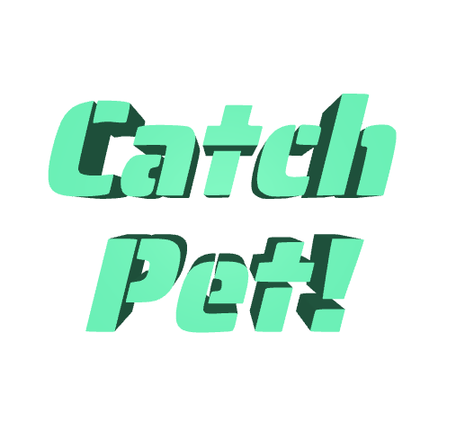

- [백엔드 링크](https://github.com/Choi-JY1107/2023-2-Capstone-Server)
- [AI 학습 코드 링크](https://github.com/Choi-JY1107/2023-2-Capstone-ML)
- [Figma 링크](https://www.figma.com/file/9HIjaQvXiTkHFFox5vRiic/3-2-%EC%BA%A1%EC%8A%A4%ED%86%A4(%EB%B0%98%EB%A0%A4%EB%8F%99%EB%AC%BC-%EC%B0%BE%EA%B8%B0)?type=design&node-id=0-1&mode=design&t=T49mA9kd5mDzEffE-0)


## 🐶 잃어버린 반려동물을 찾아드립니다.

> 사랑하는 반려 동물 사진을 다른 사람들과 함께 공유해보아요!
> 만약 반려 동물을 잃어버려도 앱에서 찾을 수 있어요!

- 반려 동물를 업로드할 수 있는 커뮤니티 기능 탑재
- 주기적으로 올라오는 사진을 딥러닝하여 잃어버린 반려 동물을 찾아준다.

# 👨‍👦‍👦 팀원 소개

|              [박유나](https://github.com/realyuna)              |            [최재영](https://github.com/Choi-JY1107)             |            [이재민](https://github.com/DancingGamza)            |
|:------------------------------------------------------------:|:------------------------------------------------------------:|:------------------------------------------------------------:|
|  |  |  |
|                       Frontend, Design                       |                      Backend, AI, Infra                      |                              PM                              |


# 🛠️  기술 스택

## Frontend
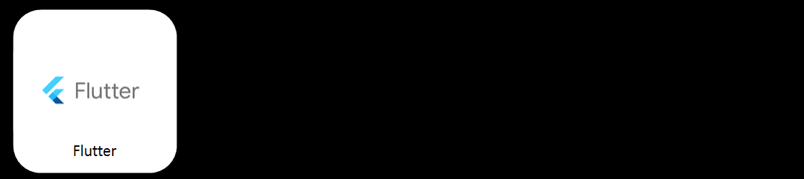


## Backend
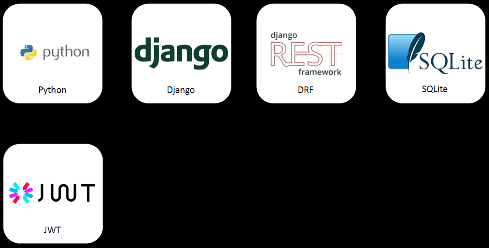


## Infra
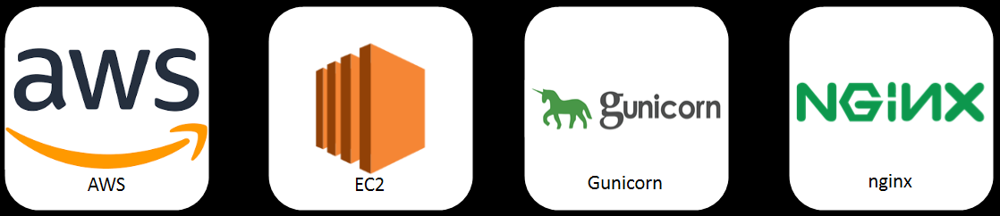


## AI
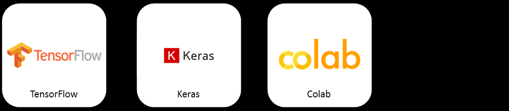

## Tool
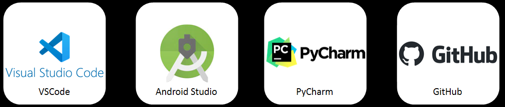


# 📃 앱 메뉴얼
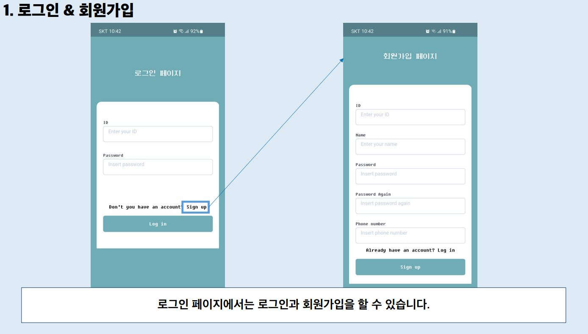
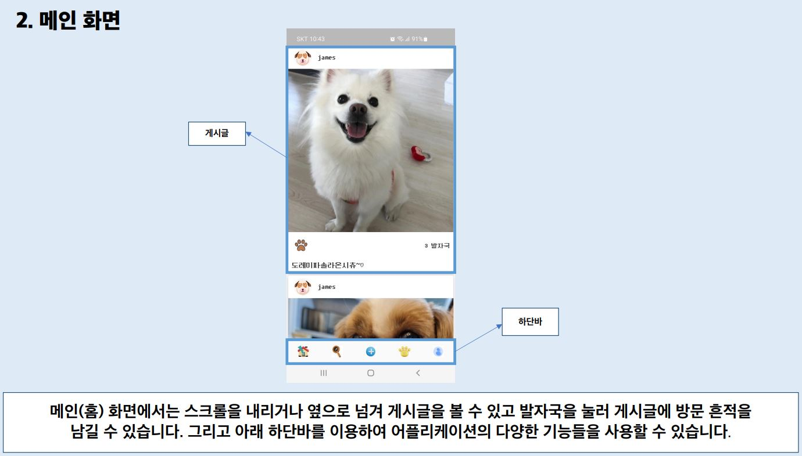
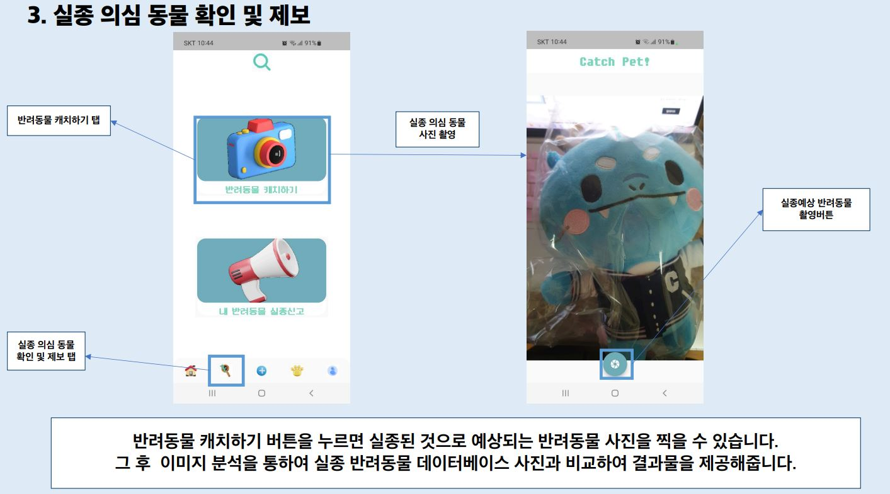
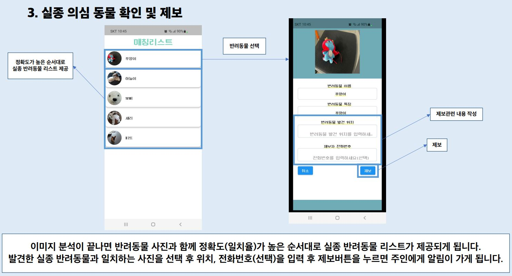
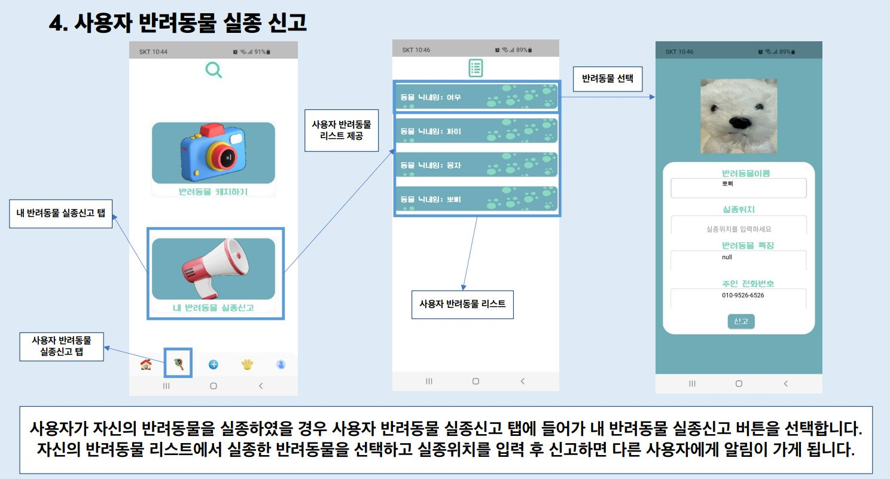
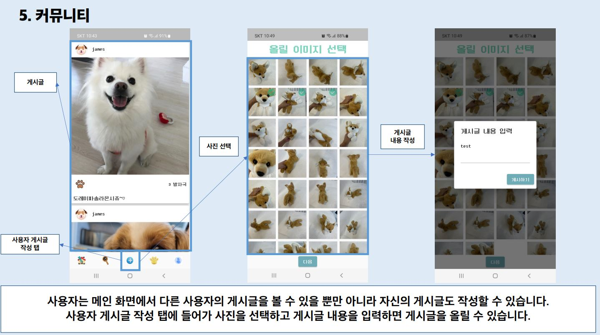
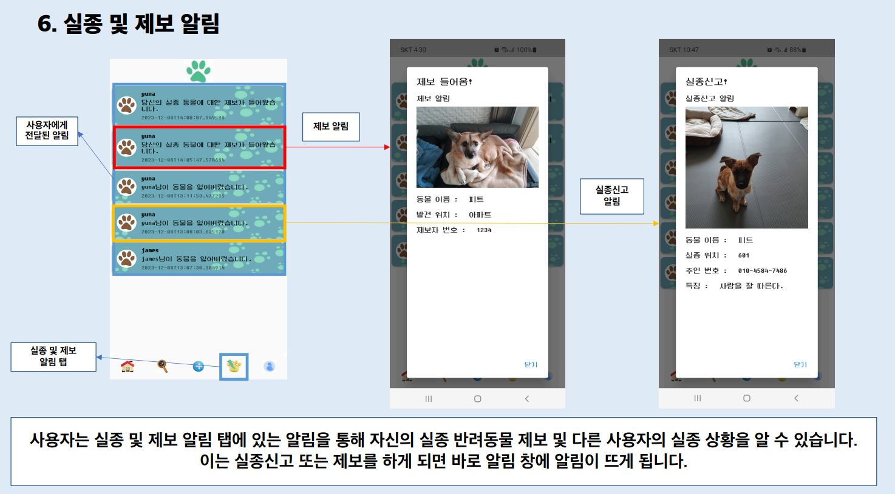
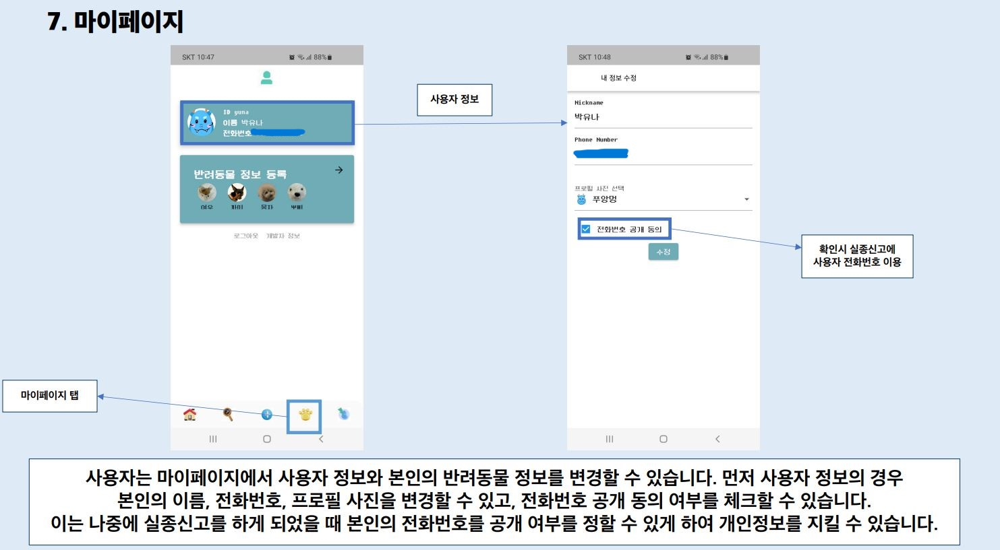
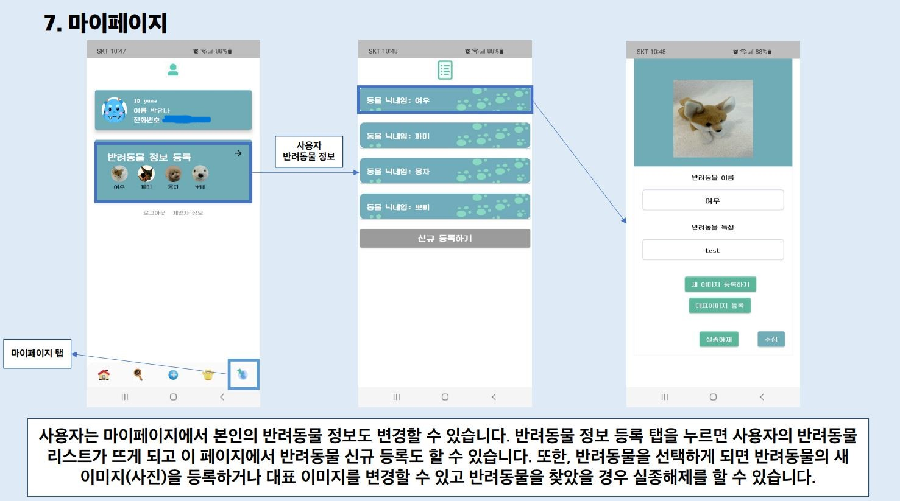


# 💿 ERD
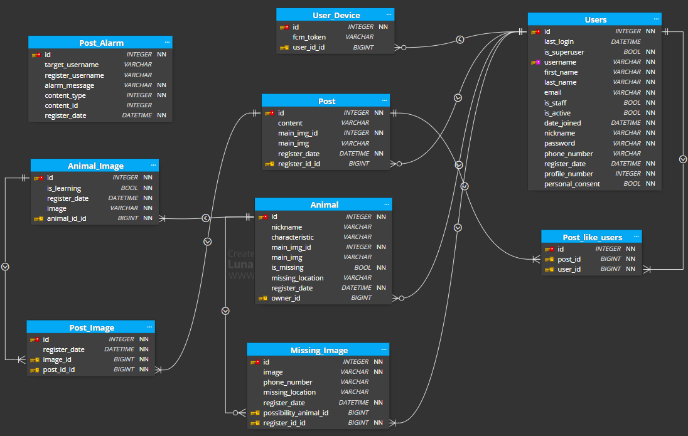


# 📱 앱 실행 방법


# 🔶 로컬 실행 방법


## 백엔드
```
git clone https://github.com/Choi-JY1107/2023-2-Capstone-Server.git
cd 2023-2-Capstone-Server
pip install -r requirements.txt 

python manage.py makemigrations
python manage.py migrate
python manage.py runserver
```
